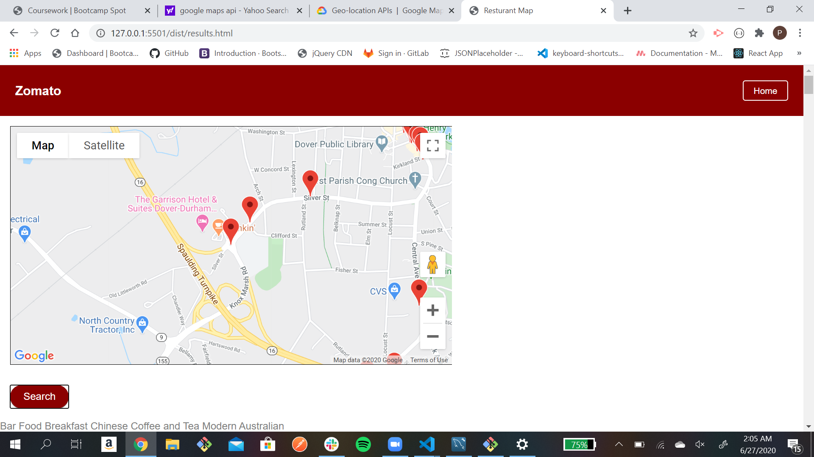

# Zomato

## Description

<p>Simple restaurant locator App in to find out more about certain restaurants in their area</p>

## Frameworks

- TailwindCSS
- Jquery
- Font Awesome

## API Usage

- https://ipapi.co/json/
- https://developers.zomato.com/api/v2.1/search
- https://developers.zomato.com/api/v2.1/cuisines
- https://maps.googleapis.com/maps/api/js

## Application



## Cited Sources

- https://api.jquery.com/jQuery.ajax/
- https://www.zomato.com/dover-nh
- https://developers.zomato.com/api
- https://www.youtube.com/watch?v=P7t13SGytRk&t=4285s
- https://developers.google.com/maps/documentation/javascript/examples/icon-complex

## Code

```
const myMap = function () {
    const mapProp = {
        // centering the location of the first restaurant in the array
        center: new google.maps.LatLng(
            restaurants[0].restaurant.location.latitude,
            // latitude of the first restaurant in the array
            restaurants[0].restaurant.location.longitude
            // longitude of the first restaurant in the array
        ),
        // default zoom when map is displayed
        zoom: 15,
    };
    const map = new google.maps.Map(
        // grabbing the "#googleMaps" element
        document.getElementById('googleMap'),
        mapProp
    );
    // create for loop for to set marker for each restaurant inside of the array
    for (i = 0; i < restaurants.length; i++) {
        marker = new google.maps.Marker({
            // setting position of marker
            position: new google.maps.LatLng(
                restaurants[i].restaurant.location.latitude,
                // latitude of the index of restaurant in the array
                restaurants[i].restaurant.location.longitude
                // longitude of the index of restaurant in the array
            ),
            // displaying title in the index of restaurants name
            title: restaurants[i].restaurant.name,
            // displaying title in the index of restaurants map
            map: map,
        });
    }
}
```

## Developer

Peter Sammon
